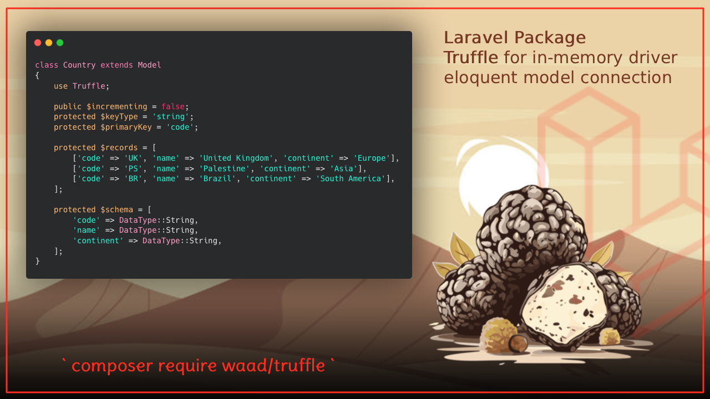

# Waad/Truffle 🍄

[](https://packagist.org/packages/waad/truffle)
[](https://github.com/waad/truffle/actions?query=workflow%3Arun-tests+branch%3Amain)
[](https://packagist.org/packages/waad/truffle)

A Laravel package for creating in-memory models using SQLite. Perfect for static data, test fixtures, and high-performance read operations.

**Features**: Zero configuration • Full Eloquent support • Type safety • Performance optimized

## Installation

```bash
composer require waad/truffle
```

## Quick Start

```php
<?php

use Illuminate\Database\Eloquent\Model;
use Waad\Truffle\Truffle;

class Product extends Model
{
    use Truffle;

    protected $fillable = ['name', 'price', 'category'];
    
    protected $casts = [
        'price' => 'float',
    ];

    // Define your in-memory data records
    protected $records = [
        ['id' => 1, 'name' => 'Laptop', 'price' => 999.99, 'category' => 'Electronics'],
        ['id' => 2, 'name' => 'Coffee Mug', 'price' => 12.50, 'category' => 'Kitchen'],
    ];
}

// Use standard Eloquent queries
$products = Product::all();
$laptop = Product::where('name', 'Laptop')->first();
$avgPrice = Product::avg('price');
```

## Data Types

### Static Data
```php
protected $records = [
    ['id' => 1, 'name' => 'John', 'email' => 'john@example.com'],
];
```

### Dynamic Data
```php
public function getRecords()
{
    return collect(range(1, 100))->map(fn($i) => [
        'id' => $i,
        'name' => "User {$i}",
        'email' => "user{$i}@example.com",
    ])->toArray();
}
```

### Schema Definition
```php
use Waad\Truffle\Enums\DataType;

protected $schema = [
    'id' => DataType::Id,
    'name' => DataType::String,
    'email' => DataType::String,
    'age' => DataType::Integer,
    'is_active' => DataType::Boolean,
    'salary' => DataType::Decimal,
    'metadata' => DataType::Json,
    'created_at' => DataType::Timestamp
];
```

## DataType Reference

| DataType | Description | DB Type |
|----------|-------------|---------|
| `DataType::Id` | Auto-increment primary key | INTEGER (PK) |
| `DataType::String` | Short string (up to 255 chars) | VARCHAR(255) |
| `DataType::Text` | Long text | TEXT |
| `DataType::Integer` | Integer number | INTEGER |
| `DataType::BigInteger` | Large integer | BIGINT |
| `DataType::Float` | Floating point number | FLOAT |
| `DataType::Decimal` | Decimal number | DECIMAL |
| `DataType::Boolean` | Boolean (true/false) | BOOLEAN |
| `DataType::Json` | JSON-encoded data | TEXT |
| `DataType::DateTime` | Date and time | DATETIME |
| `DataType::Date` | Date only | DATE |
| `DataType::Time` | Time only | TIME |
| `DataType::Timestamp` | Timestamp | TIMESTAMP |
| `DataType::Uuid` | UUID string | CHAR(36) |
| `DataType::Ulid` | ULID string | CHAR(26) |

## Advanced Usage

### Complete Model Configuration
```php
class User extends Model
{
    use Truffle;

    protected $fillable = ['name', 'email', 'age', 'department'];
    
    protected $casts = [
        'age' => 'integer',
        'is_active' => 'boolean',
    ];

    protected $records = [
        ['id' => 1, 'name' => 'Alice', 'email' => 'alice@company.com', 'age' => 30, 'is_active' => true],
    ];

    protected $schema = [
        'id' => DataType::Id,
        'name' => DataType::String,
        'email' => DataType::String,
        'age' => DataType::Integer,
        'is_active' => DataType::Boolean,
    ];

    // Scopes
    public function scopeActive($query)
    {
        return $query->where('is_active', true);
    }
}
```

### Performance Configuration
```php
protected $insertChunkRecords = 500; // Batch size for large datasets
protected $foreignKeyConstraints = true; // Enable foreign key constraints
protected $prefixDatabaseName = 'my_prefix_'; // Database name prefix

// Migration hook for custom indexes
protected function thenMigration(Blueprint $table)
{
    $table->index('name');
}
```

## Use Cases

### Static Reference Data
```php
class Country extends Model
{
    use Truffle;

    public $incrementing = false;
    protected $keyType = 'string';
    protected $primaryKey = 'code';

    protected $records = [
        ['code' => 'US', 'name' => 'United States'],
        ['code' => 'CA', 'name' => 'Canada'],
    ];
}
```

### Configuration Settings
```php
class AppSetting extends Model
{
    use Truffle;

    public $incrementing = false;
    protected $keyType = 'string'; 
    protected $primaryKey = 'key';

    protected $records = [
        ['key' => 'app_name', 'value' => 'My Application'],
        ['key' => 'maintenance_mode', 'value' => 'false'],
    ];

    public static function getValue(string $key, $default = null)
    {
        $setting = static::where('key', $key)->first();
        return $setting ? $setting->value : $default;
    }
}
```

## API Reference

### Core Methods
```php
Model::clearConnections()           // Clear all connections
$model->getRecords()                // Get all data records
$model->getSchema()                 // Get schema definition
Model::resolveConnection()          // Get the SQLite connection
```

## Testing

```bash
composer test
```

## Contributing

1. Fork the repository
2. Create a feature branch: `git checkout -b feature/amazing-feature`
3. Add tests and make your changes
4. Run tests: `composer test`
5. Submit a Pull Request

## Roadmap

- [x] Eloquent integration
- [x] SQLite in-memory support
- [ ] SQLite file support
- [ ] Caching support
- [ ] Support for CSV/JSON/XML files
- [ ] Multi-tenancy support

## Credits

Built with ❤️ for the Laravel community by [Waad Mawlood](https://github.com/waadmawlood)
