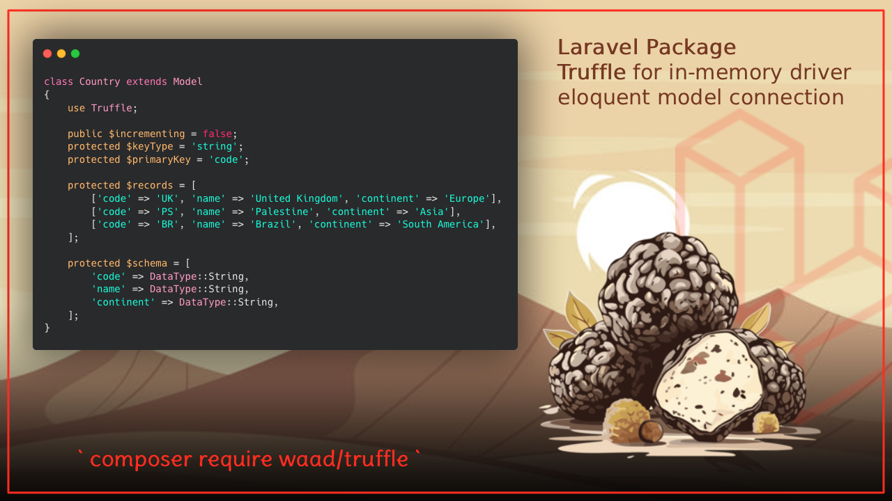

# Waad/Truffle 🍄

[](https://packagist.org/packages/waad/truffle)
[](https://github.com/waad/truffle/actions?query=workflow%3Arun-tests+branch%3Amain)
[](https://packagist.org/packages/waad/truffle)

A Laravel package for creating in-memory models using SQLite. Perfect for static data, test fixtures, and high-performance read operations.

**Features**: Zero configuration • Full Eloquent support • Type safety • Performance optimized • Per-model caching • CSV/JSON/XML file support

## Installation

```bash
composer require waad/truffle
```

## Quick Start

```php
<?php

use Illuminate\Database\Eloquent\Model;
use Waad\Truffle\Truffle;

class Product extends Model
{
    use Truffle;

    protected $fillable = ['name', 'price', 'category'];
    
    protected $casts = [
        'price' => 'float',
    ];

    // Define your in-memory data records
    protected $records = [
        ['id' => 1, 'name' => 'Laptop', 'price' => 999.99, 'category' => 'Electronics'],
        ['id' => 2, 'name' => 'Coffee Mug', 'price' => 12.50, 'category' => 'Kitchen'],
    ];
}

// Use standard Eloquent queries
$products = Product::all();
$laptop = Product::where('name', 'Laptop')->first();
$avgPrice = Product::avg('price');
```

## Data Types

### Static Data
```php
protected $records = [
    ['id' => 1, 'name' => 'John', 'email' => 'john@example.com'],
];
```

### Dynamic Data
```php
public function getRecords()
{
    return collect(range(1, 100))->map(fn($i) => [
        'id' => $i,
        'name' => "User {$i}",
        'email' => "user{$i}@example.com",
    ])->toArray();
}
```

### Schema Definition
```php
use Waad\Truffle\Enums\DataType;

protected $schema = [
    'id' => DataType::Id,
    'name' => DataType::String,
    'email' => DataType::String,
    'age' => DataType::Integer,
    'is_active' => DataType::Boolean,
    'salary' => DataType::Decimal,
    'metadata' => DataType::Json,
    'created_at' => DataType::Timestamp
];
```

## DataType Reference

| DataType | Description | DB Type |
|----------|-------------|---------|
| `DataType::Id` | Auto-increment primary key | INTEGER (PK) |
| `DataType::String` | Short string (up to 255 chars) | VARCHAR(255) |
| `DataType::Text` | Long text | TEXT |
| `DataType::Integer` | Integer number | INTEGER |
| `DataType::BigInteger` | Large integer | BIGINT |
| `DataType::Float` | Floating point number | FLOAT |
| `DataType::Decimal` | Decimal number | DECIMAL |
| `DataType::Boolean` | Boolean (true/false) | BOOLEAN |
| `DataType::Json` | JSON-encoded data | TEXT |
| `DataType::DateTime` | Date and time | DATETIME |
| `DataType::Date` | Date only | DATE |
| `DataType::Time` | Time only | TIME |
| `DataType::Timestamp` | Timestamp | TIMESTAMP |
| `DataType::Uuid` | UUID string | CHAR(36) |
| `DataType::Ulid` | ULID string | CHAR(26) |

## Advanced Usage

### Complete Model Configuration
```php
class User extends Model
{
    use Truffle;

    protected $fillable = ['name', 'email', 'age', 'department'];
    
    protected $casts = [
        'age' => 'integer',
        'is_active' => 'boolean',
    ];

    protected $records = [
        ['id' => 1, 'name' => 'Alice', 'email' => 'alice@company.com', 'age' => 30, 'is_active' => true],
    ];

    protected $schema = [
        'id' => DataType::Id,
        'name' => DataType::String,
        'email' => DataType::String,
        'age' => DataType::Integer,
        'is_active' => DataType::Boolean,
    ];

    // Scopes
    public function scopeActive($query)
    {
        return $query->where('is_active', true);
    }
}
```

### Performance Configuration
```php
protected $insertChunkRecords = 500; // Batch size for large datasets
protected $foreignKeyConstraints = true; // Enable foreign key constraints
protected $prefixDatabaseName = 'my_prefix_'; // Database name prefix

// Migration hook for custom indexes
protected function thenMigration(Blueprint $table)
{
    $table->index('name');
}
```

### SQLite File Support

By default, Truffle uses in-memory SQLite databases which are rebuilt on every request. You can persist data to a SQLite file instead, which is ideal for large datasets that don't need to be rebuilt every time.

#### Basic File Storage
```php
class Product extends Model
{
    use Truffle;

    protected static $truffleSqliteFile = '/path/to/database/products.sqlite';

    protected $records = [
        ['id' => 1, 'name' => 'Laptop', 'price' => 999.99],
        ['id' => 2, 'name' => 'Coffee Mug', 'price' => 12.50],
    ];
}
```

#### Using Laravel Helpers
```php
class Country extends Model
{
    use Truffle;

    // Store in storage/truffle/countries.sqlite
    protected static $truffleSqliteFile;

    public function __construct(array $attributes = [])
    {
        $this->truffleSqliteFile ??= storage_path('truffle/countries.sqlite');
        parent::__construct($attributes);
    }

    protected $records = [
        ['code' => 'US', 'name' => 'United States'],
        ['code' => 'CA', 'name' => 'Canada'],
    ];
}
```

> **Note:** Directories are created automatically if they don't exist. When a file-based SQLite table already exists, migration is skipped to avoid duplicate records.

#### File Management Methods
```php
// Delete the SQLite file and clear connections
Product::deleteTruffleSqliteFile();

// Delete the file and rebuild data from scratch
Product::refreshTruffleSqliteFile();

// Check if file-based SQLite is enabled
Product::isTruffleSqliteFile();

// Get the configured file path
Product::getTruffleSqliteFile();
```

#### SQLite File Properties Reference

| Property | Type | Default | Description |
|----------|------|---------|-------------|
| `$truffleSqliteFile` | `string\|null` | `null` | Path to SQLite file. `null` uses in-memory (`:memory:`) |

### Caching Support

Enable per-model caching to avoid rebuilding records on every request. Each model can independently toggle caching, choose a cache driver, and set a TTL.

#### Basic Caching (Cache Forever)
```php
class Country extends Model
{
    use Truffle;

    protected $truffleCache = true; // Enable caching

    protected $records = [
        ['code' => 'US', 'name' => 'United States'],
        ['code' => 'CA', 'name' => 'Canada'],
    ];
}
```

#### Caching with TTL
```php
class Product extends Model
{
    use Truffle;

    protected $truffleCache = true;
    protected $truffleCacheTtl = 3600; // Cache for 1 hour (seconds)

    protected $records = [
        ['id' => 1, 'name' => 'Laptop', 'price' => 999.99],
    ];
}
```

#### Custom Cache Driver & Prefix
```php
class Setting extends Model
{
    use Truffle;

    protected $truffleCache = true;
    protected $truffleCacheDriver = 'redis'; // Use Redis instead of default
    protected $truffleCacheTtl = 1800;       // 30 minutes
    protected $truffleCachePrefix = 'app_settings_'; // Custom cache key prefix

    protected $records = [
        ['key' => 'app_name', 'value' => 'My App'],
    ];
}
```

#### No Caching (Default)
```php
class TemporaryData extends Model
{
    use Truffle;

    // No $truffleCache property — caching is disabled by default

    protected $records = [
        ['id' => 1, 'label' => 'Draft'],
    ];
}
```

#### Cache Properties Reference

| Property | Type | Default | Description |
|----------|------|---------|-------------|
| `$truffleCache` | `bool` | `false` | Enable/disable caching for this model |
| `$truffleCacheDriver` | `string\|null` | `null` | Cache driver (`file`, `redis`, `array`, etc.). `null` uses Laravel default |
| `$truffleCacheTtl` | `int\|null` | `null` | Time-to-live in seconds. `null` caches forever |
| `$truffleCachePrefix` | `string` | `'truffle_'` | Prefix for the cache key |

#### Cache Management Methods
```php
// Clear cached records for a model
Product::clearTruffleCache();

// Clear cache and re-fetch fresh records
Product::refreshTruffleCache();

// Check if caching is enabled
$model->isTruffleCacheEnabled();

// Get the generated cache key
$model->getTruffleCacheKey();
```

### File-Based Records (CSV/JSON/XML)

Instead of defining records as PHP arrays, you can load them from CSV, JSON, or XML files. The file format is auto-detected from the extension.

#### CSV File
```php
class Country extends Model
{
    use Truffle;

    protected $truffleFile = __DIR__ . '/../data/countries.csv';

    protected $schema = [
        'code' => DataType::String,
        'name' => DataType::String,
    ];
}
```

The CSV file should have a header row:
```csv
code,name
US,United States
CA,Canada
UK,United Kingdom
```

#### JSON File
```php
class Product extends Model
{
    use Truffle;

    protected $truffleFile = __DIR__ . '/../data/products.json';
}
```

The JSON file should contain an array of objects:
```json
[
    {"id": 1, "name": "Laptop", "price": 999.99},
    {"id": 2, "name": "Coffee Mug", "price": 12.50}
]
```

#### XML File
```php
class Category extends Model
{
    use Truffle;

    protected $truffleFile = __DIR__ . '/../data/categories.xml';
    protected $truffleFileRecordElement = 'category';
}
```

The XML file structure:
```xml
<?xml version="1.0" encoding="UTF-8"?>
<categories>
    <category>
        <id>1</id>
        <name>Electronics</name>
    </category>
    <category>
        <id>2</id>
        <name>Kitchen</name>
    </category>
</categories>
```

#### CSV Custom Delimiter
```php
class Product extends Model
{
    use Truffle;

    protected $truffleFile = __DIR__ . '/../data/products.csv';
    protected $truffleFileDelimiter = ';';  // Semicolon-separated
    protected $truffleFileEnclosure = '"';
    protected $truffleFileEscape = '\\';
}
```

#### Dynamic File Loading

You can load file data dynamically from within `getRecords()` using the built-in helper methods:

```php
class Country extends Model
{
    use Truffle;

    public function getRecords()
    {
        return $this->fromCsvFile(__DIR__ . '/../data/countries.csv');
    }
}
```

```php
class Product extends Model
{
    use Truffle;

    public function getRecords()
    {
        return $this->fromJsonFile(storage_path('data/products.json'));
    }
}
```

```php
class Category extends Model
{
    use Truffle;

    public function getRecords()
    {
        return $this->fromXmlFile(
            __DIR__ . '/../data/categories.xml',
            'category' // record element name
        );
    }
}
```

You can also use `fromFile()` with auto-detection or explicit type:
```php
public function getRecords()
{
    // Auto-detect format from extension
    return $this->fromFile(__DIR__ . '/../data/records.csv');

    // Or specify the type and options explicitly
    return $this->fromFile(__DIR__ . '/../data/records.dat', 'csv', [
        'delimiter' => ';',
    ]);
}
```

CSV options for `fromCsvFile()`:
```php
public function getRecords()
{
    return $this->fromCsvFile(
        __DIR__ . '/../data/products.csv',
        ';',   // delimiter
        '"',   // enclosure
        '\\'   // escape
    );
}
```

> **Note:** If both `$records` and `$truffleFile` are defined, the `$records` array takes priority. This lets you override file data in tests.

#### File Properties Reference

| Property | Type | Default | Description |
|----------|------|---------|-------------|
| `$truffleFile` | `string\|null` | `null` | Path to data file (CSV, JSON, or XML) |
| `$truffleFileType` | `string\|null` | `null` | Explicit file type (`csv`, `json`, `xml`). `null` auto-detects from extension |
| `$truffleFileDelimiter` | `string` | `','` | CSV column delimiter |
| `$truffleFileEnclosure` | `string` | `'"'` | CSV field enclosure character |
| `$truffleFileEscape` | `string` | `'\\'` | CSV escape character |
| `$truffleFileRecordElement` | `string\|null` | `null` | XML child element name. `null` iterates all direct children |

#### File Methods
```php
$model->getTruffleFile()               // Get the configured file path
$model->getTruffleFileType()           // Get file type (auto-detected or explicit)
$model->getFileRecords()               // Read records from the configured $truffleFile
$model->fromFile($path)                // Read records from any file (auto-detect format)
$model->fromFile($path, 'csv', [...])  // Read with explicit type and options
$model->fromCsvFile($path)             // Read records from a CSV file
$model->fromJsonFile($path)            // Read records from a JSON file
$model->fromXmlFile($path, $element)   // Read records from an XML file
```

## Use Cases

### Static Reference Data
```php
class Country extends Model
{
    use Truffle;

    public $incrementing = false;
    protected $keyType = 'string';
    protected $primaryKey = 'code';

    protected $records = [
        ['code' => 'US', 'name' => 'United States'],
        ['code' => 'CA', 'name' => 'Canada'],
    ];
}
```

### Configuration Settings
```php
class AppSetting extends Model
{
    use Truffle;

    public $incrementing = false;
    protected $keyType = 'string'; 
    protected $primaryKey = 'key';

    protected $records = [
        ['key' => 'app_name', 'value' => 'My Application'],
        ['key' => 'maintenance_mode', 'value' => 'false'],
    ];

    public static function getValue(string $key, $default = null)
    {
        $setting = static::where('key', $key)->first();
        return $setting ? $setting->value : $default;
    }
}
```

### Rule Exist Validation `exists`
```php
use App\Models\Category;

'category_id' => ['required', 'integer', Rule::exists(Category::class, 'id')],
```

## API Reference

### Core Methods
```php
Model::clearConnections()           // Clear all connections
$model->getRecords()                // Get all data records
$model->getSchema()                 // Get schema definition
Model::resolveConnection()          // Get the SQLite connection
```

### SQLite File Methods
```php
Model::deleteTruffleSqliteFile()    // Delete the SQLite file
Model::refreshTruffleSqliteFile()   // Delete file and rebuild data
Model::isTruffleSqliteFile()        // Check if using file-based SQLite
Model::getTruffleSqliteFile()       // Get the configured file path
```

### File Methods
```php
$model->getTruffleFile()               // Get the configured file path
$model->getTruffleFileType()           // Get file type (auto-detected or explicit)
$model->getFileRecords()               // Read records from the configured $truffleFile
$model->fromFile($path)                // Read records from any file (auto-detect format)
$model->fromFile($path, 'csv', [...])  // Read with explicit type and options
$model->fromCsvFile($path)             // Read records from a CSV file
$model->fromJsonFile($path)            // Read records from a JSON file
$model->fromXmlFile($path, $element)   // Read records from an XML file
$model->getTruffleFileDelimiter()      // Get CSV delimiter
$model->getTruffleFileEnclosure()      // Get CSV enclosure character
$model->getTruffleFileEscape()         // Get CSV escape character
$model->getTruffleFileRecordElement()  // Get XML record element name
```

### Cache Methods
```php
Model::clearTruffleCache()          // Remove cached records
Model::refreshTruffleCache()        // Clear and re-cache records
$model->isTruffleCacheEnabled()     // Check if caching is active
$model->getCachedRecords()          // Get records (from cache if enabled)
$model->getTruffleCacheKey()        // Get the cache key for this model
$model->getTruffleCacheDriver()     // Get configured cache driver
$model->getTruffleCacheTtl()        // Get configured TTL
$model->getTruffleCachePrefix()     // Get configured cache key prefix
```

## Testing

```bash
composer test
```

## Contributing

1. Fork the repository
2. Create a feature branch: `git checkout -b feature/amazing-feature`
3. Add tests and make your changes
4. Run tests: `composer test`
5. Submit a Pull Request

## Roadmap

- [x] Eloquent integration
- [x] SQLite in-memory support
- [x] SQLite file support
- [x] Caching support
- [x] Support for CSV/JSON/XML files
- [ ] Multi-tenancy support

## Credits

Built with ❤️ for the Laravel community by [Waad Mawlood](https://github.com/waadmawlood)
